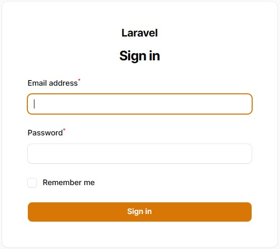
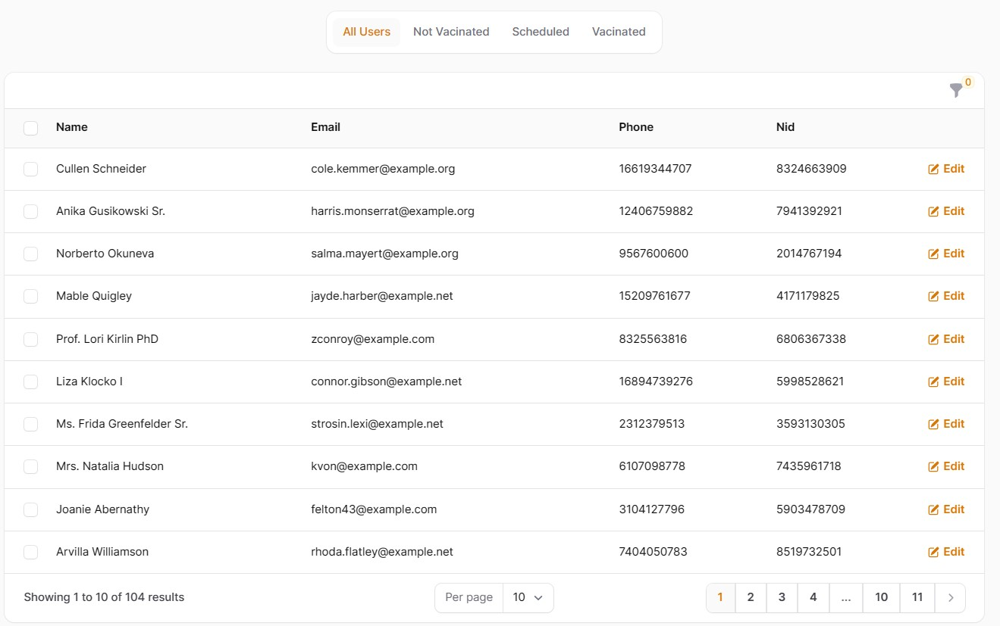
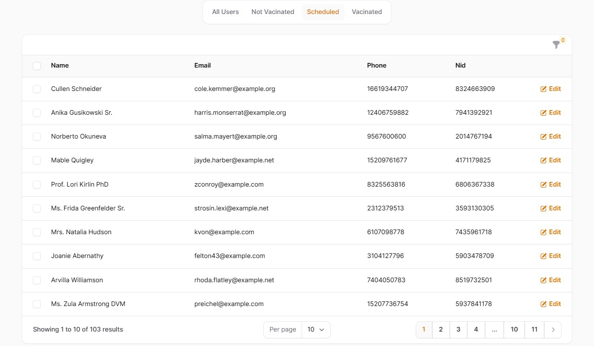
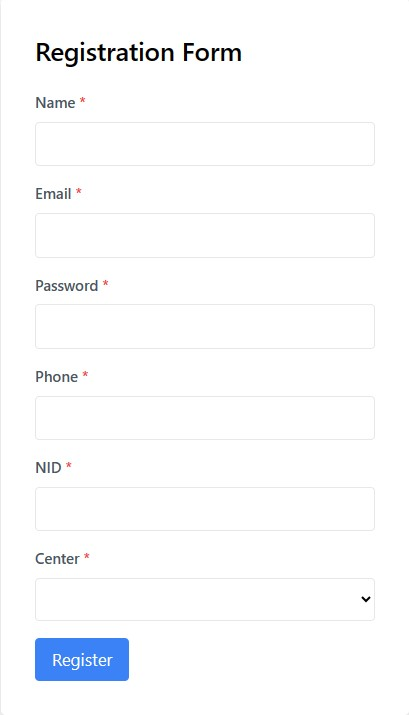

 <h1>Vaccine Registration System</h1>

The Vaccine Registration System is a Laravel project designed to manage two types of users: admin users and public users. Admin users have access to the <code>users</code> table, while public users are managed through the <code>public_users</code> table.

<h2>Requirements</h2>

<ul>
        <li>PHP &gt;= 7.2</li>
        <li>Laravel 9+</li>
    </ul>

<h2>Setup Instructions</h2>

<ol>
        <li>Clone the repository.</li>
        <li>Run <code>composer install</code> to install dependencies.</li>
        <li>Copy the <code>.env.example</code> file to <code>.env</code> and configure your database.</li>
        <li>Run <code>php artisan key:generate</code> to generate an application key.</li>
        <li>Run <code>php artisan migrate</code> to run database migrations.</li>
        <li>Run <code>php artisan db:seed</code> to seed the database.</li>
    </ol>

<h3>Database Seeding</h3>

<ol>
    <li>Running the <code>php artisan db:seed</code> command creates 100 public users and one admin user.</li>
        <li>Admin user credentials:
            <ul>
                <li>Route: <code>yourdomain/admin/login</code></li>
                <li>Email: admin@test.com</li>
                <li>Password: 12345</li>
                <li>Admin users can view all public users from the dashboard.</li>
            </ul>
        </li>
    </ol>

<h2>Features</h2>
<h3>Public User Registration</h3>
<ol>
        <li>Public users can register through the <code>/register</code> route.</li>
        <li>Registration requires the following fields:
            <ul>
                <li>Name</li>
                <li>Email</li>
                <li>Password</li>
                <li>National ID (NID)</li>
                <li>Phone</li>
                <li>Center Name (selected from a dropdown)</li>
            </ul>
        </li>
        
    </ol>

<h3>User Status Management</h3>

<ol>
        <li>Public users are assigned a default status of "not vaccinated" upon registration.</li>
        <li>Using Laravel queue and task scheduling, the <code>ScheduleUnvaccinatedUsersJob</code> class changes the status of users to "scheduled" and sends an email to notify them.</li>
        <li>The <code>ResetVaccineCenterLimitJob</code> class runs daily to reset the limit of vaccination centers.</li>
        <li>The <code>ProcessVaccinatedUsersJob</code> class changes the status to "vaccinated" if the scheduled date is less than or equal to the current date.</li>
    </ol>

<h2>Screenshots</h2>

    
<em>This is a admin login page overview</em>

    
<em>This is a User List page overview for admin user</em>

    
<em>This is a User List filter overview for admin user</em>

    
<em>This is a public users registration page overview</em>

 
